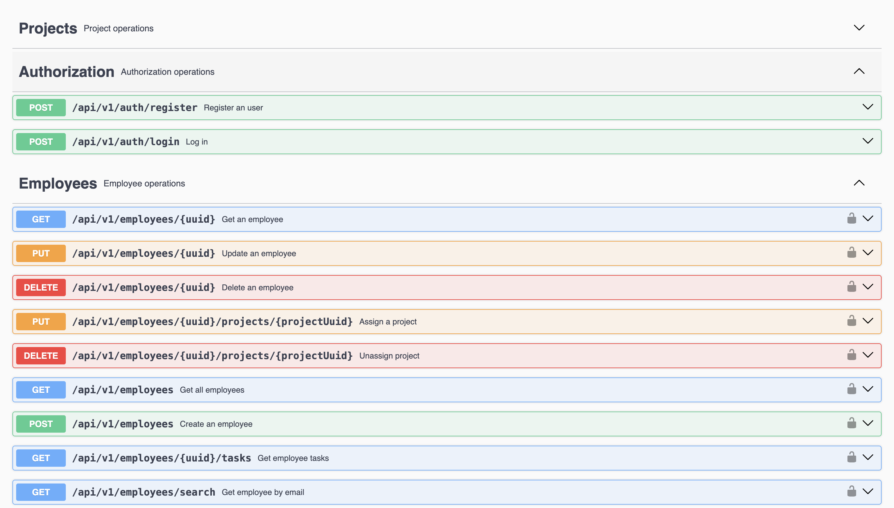

# Company Management API
Company Management API to manage employees, tasks and projects.


## Table of Contents

- [Description](#description)
- [Api Documentation](#api-documentation)
- [Project Goals](#project-goals)
- [Main Features](#main-features)
- [Technologies](#technologies)
- [Installation and Configuration](#installation-and-configuration)
- [Run with Docker](#run-with-docker)
- [Usage](#usage)
- [Project Architecture](#project-architecture)
- [Roadmap](#roadmap)
- [Author](#author)

---

## Description
Task Manager API built with Spring Boot following clean architecture and industry best practices.
This project focuses on backend development concepts such security, persistence, testing and good API design.

---

## Api Documentation
This API is documented using OpenAPI (Swagger), providing clear overview of all available endpoints and security requiremets.



---

## Project Goals

The main purpose of this is apply the best practices while simulating a real-world application.

- Designing a clean and maintainable REST API
- Applying layered architecture principles (Controller, Service, Repository)
- Implementing authentication and authorization using JWT
- Managing persistence with JPA and PostgreSQL
- Handling database versioning with Flyway
- Applying centralized exception handling
- Implementing role-based access control
- Writing unit tests for business logic
- Preparing the application for containerized deployment using Docker

---

## Main features
- CRUD with employees, tasks and projects following business rules.
- Assign and unassign tasks to employees and to projects.
- Authentication using email and password (Generating a JWT)
- Password encoded in the database.

---

## Technologies
- Java 17
- Spring boot 3
- Spring Security (Authentication and authorization)
- JPA/Hibernate (interact with the DB)
- PostgreSQL (Relational DB)
- JUnit and Mockito (Unit tests)
- Flyway (DB Migrations)
- Docker (Containerization)
- GitHub Actions (CI)
- SonarLite (AI Code Review)

---

## Installation and configuration

1. Cloning the repository

```bash
git clone https://github.com/RubenAC1999/spring-demo.git
cd spring-demo
```

2. Access to Database configuration
```bash
spring:
  datasource:
    url: jdbc:postgresql://localhost:5432/demodb?currentSchema=company
    username: db_user
    password: user123

    jpa:
      hibernate:
        ddl-auto: validate
```

3. Compile the project
```bash
mvn clean install
```

4. Run the project
```bash
mvn spring-boot:run
```

---

## Run with Docker
```bash
docker compose up --build
```

The application will be available at:

http://localhost:8080

### Default Admin User
For a quick test, the application includes a Flyway migration that creates an **admin user** automatically.

You can use the following credentials to authenticate and test secured endpoints:

- **Email:** `admin@local.com`
- **Password:** `abc123.`

---

## Usage
### Main endpoints
- **Authorization**
    - Register: POST api/v1/auth/register
    - Log in: POST api/v1/auth/login

- **Employees**
    - List all employees: GET /employees
    - Obtain a employee:
      - By UUID: GET api/v1/employees/{uuid}
      - By email: GET api/v1/employees/search?email=example
      - By name: GET api/v1/employees/search-by-name?name=example
      - By position: GET api/v1/employees/search-by-position?position=DEVELOPER
    - List employee's tasks: api/v1/employees/{uuid}/tasks
    - Assign a project: PUT api/v1/employees/{uuid}/assignProject/{projectUuid}
    - Unassign a project: PUT api/v1/employees/{uuid}/unassignProject/{projectUuid}

- **Tasks**
  - List all tasks: GET api/v1/tasks (Pageable)
  - Obtain tasks:
      - By UUID: GET api/v1/tasks/{Uuid}
      - By description: GET api/v1/tasks/search-by-description?description="description"
      - By status: GET api/v1/tasks/search-by-status?status=status
      - unassigned: GET api/v1/tasks/search-unassigned
    - Assign it to an employee: PUT api/v1/tasks/{uuid}/assign/{employeeUuidd}

- **Projects**
  - List all projects: GET api/v1/projects
  - Obtain projects:
    - By UUID: GET api/v1/projects/{uuid}
    - By name: GET api/v1/projects/search?name="name"
  - List project employees: GET api/v1/{uuid}/employees
  - List project tasks: GET api/v1/{uuid}/tasks

## Project architecture

```text
src/main/java/com/example/demoPersonal
│
├── config/         # Global configuration
├── controller/     # REST endpoints
├── service/        # Business rules
├── repository/     # Database access (Spring JPA)
├── entity/         # JPA entities and enums
├── dto/            # Data Transfer Objects
├── mapper/         # Conversión Entity ↔ DTO
├── security/       # Security configuration (Spring Security)
└── exception/      # Customized and centralized exceptions.

```

## Roadmap

### Completed

- Implemented layered architecture (Controller → Service → Repository)  ✅
- Entity modeling with JPA/Hibernate (relationships, lazy loading)  ✅
- DTO mapping using Java Records  ✅
- Global exception handling (GlobalExceptionHandler)  ✅
- Business rules implemented in services  ✅
- Logging using SLF4J  ✅
- JWT authentication & authorization (Spring Security)  ✅
- Password hashing with BCrypt  ✅
- Unit tests for service layer (JUnit + Mockito)  ✅
- API tested manually using Postman  ✅
- Initial documentation and project setup  ✅
- Implement flyway to manage db migrations  ✅
- Implement roles and endpoint control access  ✅
- Create endpoint "self" (Employees with role "User" just can see their tasks, and their project unassigned tasks.)  ✅
- Refactor ID and use UUID instead.  ✅
- Controller layer tests (MockMvc)  ✅
- Document API using OpenAPI/Swagger  ✅
- Containerization with Docker  ✅
- Fix HTTP response code bug ✅
- Add a simple Pipeline using GitHub Actions ✅

### TO-DO
- Metrics and Monitoring

---

## Author
Rubén Agra Casal

Gmail: rubenagra99@gmail.com

LinkedIn: [rubenagradev](https://www.linkedin.com/in/rubenagradev/)


